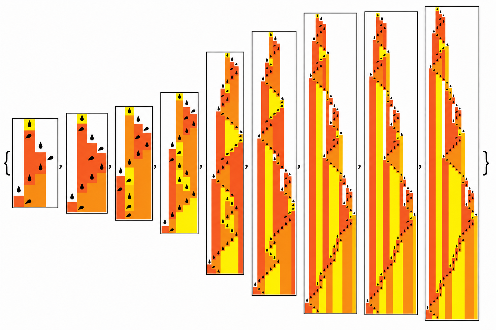
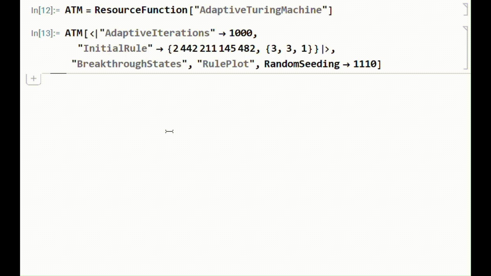
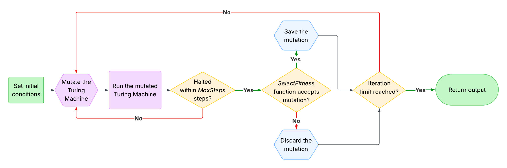
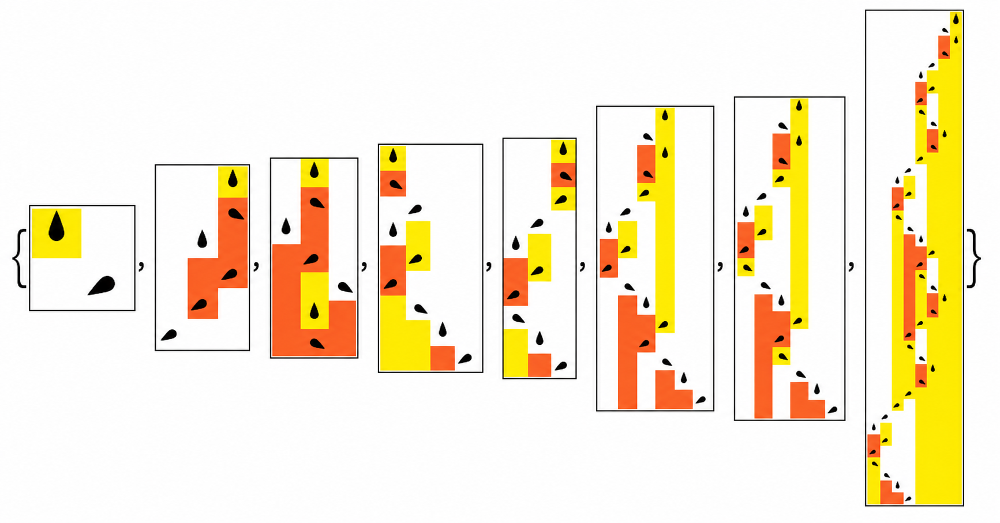
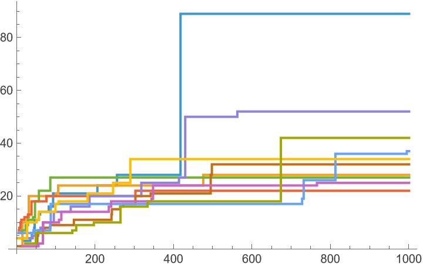

# AdaptiveTuringMachine



## Project Description

`AdaptiveTuringMachine` runs an adaptive evolution of a 1-dimensional, deterministic Turing Machine. Given an initial rule, the adaptive evolution repeatedly applies mutations to the current rule, evaluates the fitness of the corresponding Turing Machine, and then selects the ones that have successful mutations.

The purpose of this function is to categorize the complex behaviors that arise from relatively simple rules and, in particular, to explore how similar rules can lead to very different outcomes.

---

## Table of Contents

- [Quickstart Guide](#quickstart-guide)
- [Feature List](#feature-list)
  - [Core Options](#core-options)
  - [Fitness Functions](#fitness-functions)
  - [Outputs](#outputs)
  - [State Selection](#state-selection)
- [Architecture Diagram](#architecture-diagram)
- [Usage Examples](#usage-examples)
  - [Example 1: Visualizing Breakthrough States](#example-1-visualizing-breakthrough-states)
  - [Example 2: Comparing Fitness Across Multiple Runs](#example-2-comparing-fitness-across-multiple-runs)
  - [Example 3: Targeting a Lifetime Value](#example-3-targeting-a-lifetime-value)
- [FAQ](#faq)
- [Link to WFR Documentation](#link-to-wfr-documentation)

---

## Quickstart Guide

In any Wolfram notebook, run the following code to use the `AdaptiveTuringMachine` function:

```wolfram
ResourceFunction["AdaptiveTuringMachine"]
```



> **Note:** This requires Wolfram Language 13.0, released December 2021, or above to run properly.

---

## Feature List

### Core Options

`AdaptiveTuringMachine` includes several options for configuring the adaptive evolution process:

- `"InitialRule"`  
  Allows you to specify the starting rule for the Turing Machine, as well as which Turing Machines to choose from.

- `"InitialCondition"`  
  Allows you to set the initial state of the tape and the head of the Turing Machine.

- `"AdaptiveIterations"`  
  Allows you to set the number of mutation steps performed.

- `"MaxSteps"`  
  Allows you to set the step limit for detecting whether each Turing Machine has halted.

- `"MutationFunction"`  
  Allows you to specify the number and type of mutations performed per step.

- `"FitnessFunction"`  
  Allows you to choose what the adaptive evolution is trying to optimize.

---

### Fitness Functions

The following built-in fitness functions are supported:

- `"Lifetime"`  
  Optimizes for longer halting time.

- `"Width"`  
  Optimizes for a wider tape pattern.

- `"AspectRatio"`  
  Optimizes for lifetime divided by width.

You can also use:

- `"FitnessFunction" -> target`  
  Sets the adaptive evolution to target a particular value for any of the fitness functions.

- A user-specified function  
  The custom function should take the rule and initial condition as input.

---

### Outputs

The function supports several output types:

- `"BestRule"`  
  Gives the highest-fitness rule found.

- `"BestFitness"`  
  Gives the highest numerical fitness value found.

- `"Fitness"`  
  Gives the fitness value at each step of the adaptive evolution.

- `"Lifetime"`  
  Gives the number of steps before halting for each step of the adaptive evolution.

- `"Width"`  
  Gives the width of the tape pattern for each step of the adaptive evolution.

- `"RulePlot"`  
  Gives a 2D visualization of the tape pattern for each step of the adaptive evolution, including the location and state of the Turing Machine head.

- `"ArrayPlot"`  
  Gives a 2D visualization of the tape pattern without visualizing the Turing Machine head.

---

### State Selection

For the outputs above, you can also specify which states are selected:

- `"All"`  
  Gives all steps of the adaptive evolution.

- `"FinalState"`  
  Gives the last step of the adaptive evolution.

- `"BreakthroughStates"`  
  Gives the steps of the adaptive evolution that achieve a highest-so-far fitness value.

---

## Architecture Diagram

Here is a high-level overview of how `AdaptiveTuringMachine` works:



---

## Usage Examples

### Example 1: Visualizing Breakthrough States

Evolve for 1000 steps and plot the breakthrough mutation steps (i.e., those steps that achieve a new highest fitness) each as a `RulePlot`:

```wolfram
ResourceFunction["AdaptiveTuringMachine"][
  <|
    "AdaptiveIterations" -> 1000,
    "InitialRule" -> {2442211145482, {3, 3, 1}}
  |>,
  "BreakthroughStates",
  "RulePlot",
  RandomSeeding -> 1110
]
```



---

### Example 2: Comparing Fitness Across Multiple Runs

Plot the progressive best fitness values for 10 evolutions:

```wolfram
ListStepPlot[
  Table[
    ResourceFunction["AdaptiveTuringMachine"][
      <|
        "AdaptiveIterations" -> 1000,
        "InitialRule" -> {2442211145482, {3, 3, 1}}
      |>,
      All,
      "BestFitness",
      RandomSeeding -> 1100 + i
    ],
    {i, 10}
  ],
  PlotRange -> All
]
```



---

### Example 3: Targeting a Lifetime Value

Adaptively evolve a Turing Machine to have a specific lifetime (45 steps in this case):

```wolfram
ResourceFunction["AdaptiveTuringMachine"][
  <|
    "InitialRule" -> {0, {2, 5, 1}},
    "AdaptiveIterations" -> 1500,
    "FitnessFunction" -> "Lifetime" -> 45,
    "MaxSteps" -> 250
  |>,
  "BreakthroughStates",
  "RulePlot",
  "PlotLabels" -> "Lifetime",
  RandomSeeding -> 1000
]
```


---

## FAQ

### Is there a way for the tape to adaptively evolve instead of the Turing Machine?

Yes. To have the adaptive evolution mutate the initial condition of the tape, use the following:

```wolfram
"MutationFunction" -> ("InitialCondition" -> {bool, 1})
```

Here, `bool` should be either `True` or `False`, indicating whether the adaptive evolution should also mutate the Turing Machine rule.

---

### Is there a way to set the adaptive evolution up so that the fitness can decrease by a small amount in a mutation step?

Yes. To allow the adaptive evolution to work in this way, modify the `"SelectionFunction"`.

For example, if the adaptive evolution should accept mutated rules that decrease the fitness by at most `n`, you can set the selection function as follows:

```wolfram
"SelectionFunction" -> (#1 >= #2 - n &)
```

---

### Why does `"RulePlot"` not work for Turing Machines with radius greater than 1?

The `"RulePlot"` feature uses the underlying Wolfram Language function `RulePlot`, which does not support offsets besides `-1`, `0`, or `1`. In other words, it only supports radius `<= 1` offsets.

For Turing Machine visualizations with larger radii, use `"ArrayPlot"` instead.

---

## Link to WFR Documentation

Here is a link to the official Wolfram Function Repository entry and documentation for `AdaptiveTuringMachine`:

[AdaptiveTuringMachine — Wolfram Function Repository](https://resources.wolframcloud.com/FunctionRepository/resources/AdaptiveTuringMachine/)
```