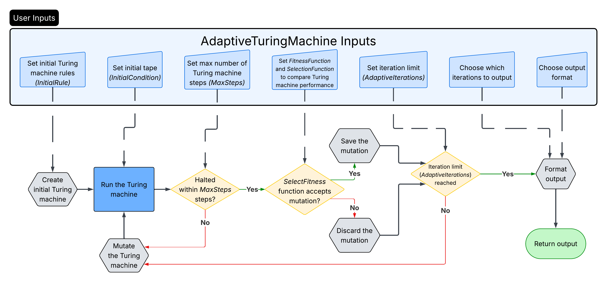
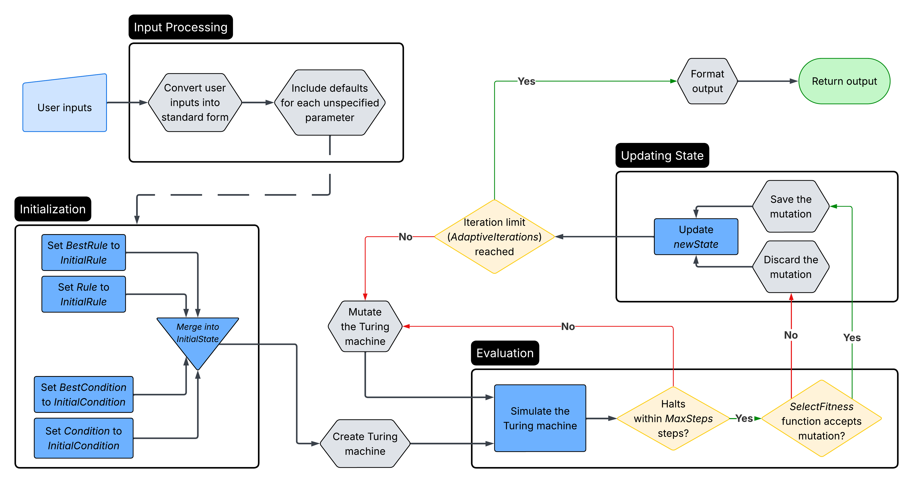

# AdaptiveTuringMachine


## Project Description

`AdaptiveTuringMachine` runs an adaptive evolution of a 1-dimensional, deterministic Turing Machine. Given an initial rule, the adaptive evolution repeatedly applies mutations to the current rule, evaluates the fitness of the corresponding Turing Machine, and then selects the ones that have successful mutations.

The purpose of this function is to categorize the complex behaviors that arise from relatively simple rules and, in particular, to explore how similar rules can lead to very different outcomes.

## Why This Code Is Valuable

`AdaptiveTuringMachine` turns the manual process of testing individual Turing Machine rules into a systematic, reproducible search. By allowing users to define what counts as successful behavior, it can uncover high-performing or unexpected machines that may be difficult to find by inspection alone. This makes the function useful for studying emergent computation, comparing evolutionary strategies, and exploring how small changes to simple rules can produce dramatically different results.

---

## Table of Contents

- [Quickstart Guide](#quickstart-guide)
- [Architecture Diagram](#architecture-diagram)
  - [High-Level Architecture Diagram](#high-level-architecture-diagram)
  - [Low-Level Architecture Diagram](#low-level-architecture-diagram)
- [Syntax Reference](#syntax-reference)
  - [Call Structure](#call-structure)
  - [Input Association](#input-association)
  - [Fitness Functions](#fitness-functions)
  - [State Selection](#state-selection)
  - [Output Types](#output-types)
  - [Additional Options](#additional-options)
- [Examples](#examples)
  - [Example 1: Visualizing Breakthrough States](#example-1-visualizing-breakthrough-states)
  - [Example 2: Comparing Fitness Across Multiple Runs](#example-2-comparing-fitness-across-multiple-runs)
  - [Example 3: Targeting a Lifetime Value](#example-3-targeting-a-lifetime-value)
- [FAQ](#faq)
- [Link to WFR Documentation](#link-to-wfr-documentation)

---

## Quickstart Guide

In any Wolfram notebook, run the following code to use the `AdaptiveTuringMachine` function:

```wolfram
ResourceFunction["AdaptiveTuringMachine"]
```


> **Note:** This requires Wolfram Language 13.0, released December 2021, or above to run properly.

---

## Architecture Diagram

### High-Level Architecture Diagram

This diagram provides a high-level overview of how `AdaptiveTuringMachine` works.



### Low-Level Architecture Diagram

This diagram provides a detailed view of the internal architecture and execution flow of `AdaptiveTuringMachine`.



---

## Syntax Reference

### Call Structure

Use `AdaptiveTuringMachine` with an association of evolution settings, followed by a state-selection argument and an output-type argument:

```wolfram
ResourceFunction["AdaptiveTuringMachine"][
  <|inputKey1 -> value1, inputKey2 -> value2, ...|>,
  stateSelection,
  outputType
]
```

Options that control reproducibility or output formatting can follow the output type:

```wolfram
ResourceFunction["AdaptiveTuringMachine"][
  <|inputKey1 -> value1, inputKey2 -> value2, ...|>,
  stateSelection,
  outputType,
  option1 -> value1,
  ...
]
```

### Input Association

The first argument is an association containing any of the following keys:

| Key | Allowable value | Purpose |
| --- | --- | --- |
| `"InitialRule"` | A valid Turing Machine rule, such as `{2442211145482, {3, 3, 1}}` | Sets the starting rule and Turing Machine configuration. |
| `"InitialCondition"` | A valid initial tape and head configuration | Sets the initial tape, head position, and head state. |
| `"AdaptiveIterations"` | A non-negative integer | Sets the number of mutation steps to attempt. |
| `"MaxSteps"` | A positive integer | Sets the simulation limit used to determine whether a machine halts. |
| `"MutationFunction"` | A supported mutation specification or a user-defined mutation function | Controls what is mutated and how many mutations are performed at each step. |
| `"FitnessFunction"` | `"Lifetime"`, `"Width"`, `"AspectRatio"`, a target specification, or a user-defined function | Defines how candidate Turing Machines are evaluated. |
| `"SelectionFunction"` | A function of the candidate and current fitness values | Determines whether a mutation is accepted. |

For example:

```wolfram
<|
  "InitialRule" -> {2442211145482, {3, 3, 1}},
  "AdaptiveIterations" -> 1000,
  "MaxSteps" -> 250
|>
```

Keys that are omitted use the function's built-in defaults. See the [official WFR documentation](#link-to-wfr-documentation) for the current default values and complete forms accepted by each key.

### Fitness Functions

The `"FitnessFunction"` key accepts the following built-in terms:

| Value | Optimizes for |
| --- | --- |
| `"Lifetime"` | A longer halting time |
| `"Width"` | A wider tape pattern |
| `"AspectRatio"` | Lifetime divided by width |

To target a specific value instead of maximizing it, map the fitness term to a numeric target:

```wolfram
"FitnessFunction" -> ("Lifetime" -> 45)
```

A user-defined fitness function may also be supplied. It must accept the Turing Machine rule and initial condition as its arguments and return a numerical fitness value:

```wolfram
"FitnessFunction" -> Function[rule, initialCondition]
```

### State Selection

The second positional argument selects which adaptive-evolution states are returned:

| Value | States returned |
| --- | --- |
| `All` | Every step of the adaptive evolution |
| `"FinalState"` | Only the final state |
| `"BreakthroughStates"` | States that achieve a new highest-so-far fitness |

### Output Types

The third positional argument controls the returned data or visualization:

| Value | Output |
| --- | --- |
| `"BestRule"` | The highest-fitness rule found |
| `"BestFitness"` | The highest numerical fitness found |
| `"Fitness"` | The fitness value for each selected state |
| `"Lifetime"` | The number of steps before halting for each selected state |
| `"Width"` | The tape-pattern width for each selected state |
| `"RulePlot"` | A 2D tape visualization that includes the head location and state |
| `"ArrayPlot"` | A 2D tape visualization without the Turing Machine head |

For example, the following positional arguments return a `RulePlot` for each breakthrough state:

```wolfram
"BreakthroughStates",
"RulePlot"
```

### Additional Options

Options can be placed after the output-type argument:

| Option | Allowable value | Purpose |
| --- | --- | --- |
| `RandomSeeding` | An integer seed | Makes randomized adaptive evolutions reproducible. |
| `PlotLabels` | An output property such as `"Lifetime"` | Labels generated plots with the selected property. |

Plot-related options are relevant when using `"RulePlot"` or `"ArrayPlot"` output.

### Warning

The underlying Wolfram Language `RulePlot` function only supports Turing Machine offsets from `-1` through `1`; use `"ArrayPlot"` for machines with a larger radius.

---

## Examples

### Example 1: Visualizing Breakthrough States

Evolve for 1000 steps and plot the breakthrough mutation steps (i.e., those steps that achieve a new highest fitness) each as a `RulePlot`:

```wolfram
ResourceFunction["AdaptiveTuringMachine"][
  <|
    "AdaptiveIterations" -> 1000,
    "InitialRule" -> {2442211145482, {3, 3, 1}}
  |>,
  "BreakthroughStates",
  "RulePlot",
  RandomSeeding -> 1110
]
```


#### How to Read the Output

- Each figure in the list represents a **breakthrough state**: an adaptive-evolution step that achieved a new highest-so-far fitness, which is measured by the lifetime of the Turing Machine.
- The panels appear chronologically and omit iterations that did not set a new record.
- Within each `RulePlot`, read downward to follow the Turing Machine through time and horizontally to follow positions on the tape.
- Cell colors represent symbols on the tape.
- The highlighted head marker shows the head's position.
- The orientation of the head marker shows the head's state.

---

### Example 2: Comparing Fitness Across Multiple Runs

Plot the progressive best fitness values for 10 evolutions:

```wolfram
ListStepPlot[
  Table[
    ResourceFunction["AdaptiveTuringMachine"][
      <|
        "AdaptiveIterations" -> 1000,
        "InitialRule" -> {2442211145482, {3, 3, 1}}
      |>,
      All,
      "BestFitness",
      RandomSeeding -> 1100 + i
    ],
    {i, 10}
  ],
  PlotRange -> All
]
```


#### How to Read the Output

- Each staircase line represents one of the 10 independent adaptive evolutions.
- The horizontal axis is the adaptive iteration number, from the initial state through iteration 1000. The vertical axis is the best fitness found so far in that run.
- Horizontal plateaus indicate no improvement in best fitness. An upward jump marks a breakthrough that established a new best fitness.

---

### Example 3: Targeting a Lifetime Value

Adaptively evolve a Turing Machine to have a specific lifetime (45 steps in this case):

```wolfram
ResourceFunction["AdaptiveTuringMachine"][
  <|
    "InitialRule" -> {0, {2, 5, 1}},
    "AdaptiveIterations" -> 1500,
    "FitnessFunction" -> "Lifetime" -> 45,
    "MaxSteps" -> 250
  |>,
  "BreakthroughStates",
  "RulePlot",
  "PlotLabels" -> "Lifetime",
  RandomSeeding -> 1000
]
```


#### How to Read the Output

- Each diagram in this example can be read in the same way as the diagrams in [Example 1](#example-1-visualizing-breakthrough-states).
- The plot label reports the displayed machine's lifetime. Here, improvement means moving closer to the target value of 45, rather than simply producing the longest possible lifetime.
- The lifetime does not necessarily need to increase at every breakthrough; it needs to become closer to 45.
- A displayed lifetime of 45 means the target has been reached. `MaxSteps -> 250` is the simulation cutoff used when testing whether each candidate halts.

---

## FAQ

### Is there a way for the tape to adaptively evolve instead of the Turing Machine?

Yes. To have the adaptive evolution mutate the initial condition of the tape, use the following:

```wolfram
"MutationFunction" -> ("InitialCondition" -> {bool, 1})
```

Here, `bool` should be either `True` or `False`, indicating whether the adaptive evolution should also mutate the Turing Machine rule.

---

### Is there a way to set the adaptive evolution up so that the fitness can decrease by a small amount in a mutation step?

Yes. To allow the adaptive evolution to work in this way, modify the `"SelectionFunction"`.

For example, if the adaptive evolution should accept mutated rules that decrease the fitness by at most `n`, you can set the selection function as follows:

```wolfram
"SelectionFunction" -> (#1 >= #2 - n &)
```

---

### Why does `"RulePlot"` not work for Turing Machines with radius greater than 1?

The `"RulePlot"` feature uses the underlying Wolfram Language function `RulePlot`, which does not support offsets besides `-1`, `0`, or `1`. In other words, it only supports radius `<= 1` offsets.

For Turing Machine visualizations with larger radii, use `"ArrayPlot"` instead.

---

## Link to WFR Documentation

Here is a link to the official Wolfram Function Repository entry and documentation for `AdaptiveTuringMachine`:

[AdaptiveTuringMachine — Wolfram Function Repository](https://resources.wolframcloud.com/FunctionRepository/resources/AdaptiveTuringMachine/)
